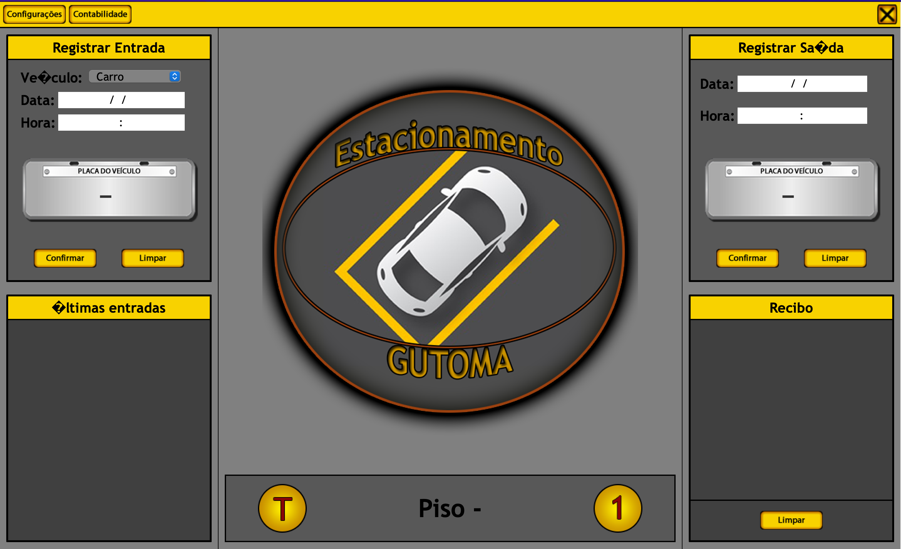
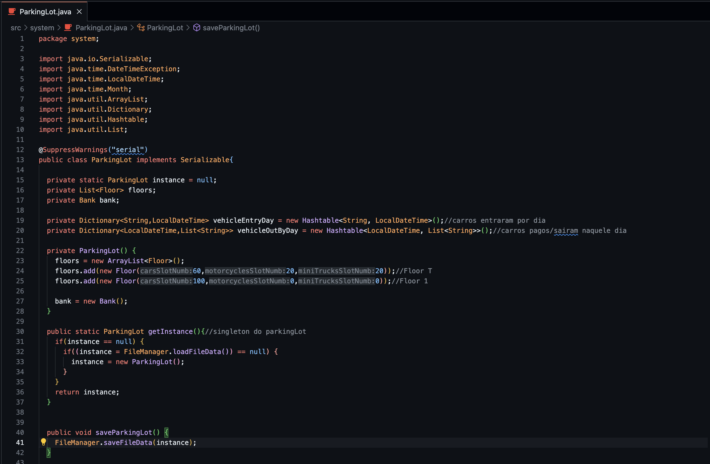

# Parking Lot System

> Manage the Parking Lot income/outcome and how much each vehicle has to pay.

> You can manage different types of vehicles and place them in many floors and spots.

> Written in Java with the purpose of learning the language and the OOP concepts.
